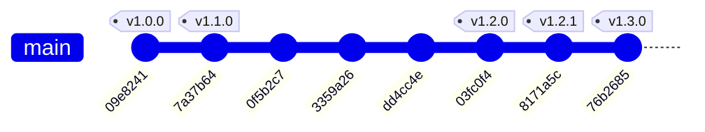

# 📋 Журнал изменений и актуальное состояние TimeTracker (Changelog)

Все ключевые изменения, доработки и хронология развития проекта TimeTracker собраны в этом документе.

---

## 📌 Текущее актуальное состояние проекта (на сентябрь 2026)

TimeTracker представляет собой полнофункциональное автономное приложение для учета рабочего времени (**Offline-First PWA**) со стеком **FastAPI + React 18 (TypeScript) + SQLite**.

### 🌟 Ключевые архитектурные и функциональные возможности:
1. **Offline-First & фоновая синхронизация**:
   - Приложение полностью функционально без доступа к сети.
   - Таймер продолжает отсчет локально в браузере.
   - Все действия (создание, удаление, редактирование задач, пуск/пауза таймера) применяются мгновенно через **Optimistic UI**.
   - Очередь мутаций (`Sync Queue`) сохраняется в `localStorage` и автоматически отправляется на сервер при восстановлении сети.
   - Клиентская генерация UUID и фиксация точных временных меток (`at`) предотвращают погрешности в длительности интервалов при отложенной синхронизации.
   - Индикатор сетевого статуса в реальном времени: `Онлайн`, `Офлайн`, `Синхронизация` с отображением количества неотправленных действий.

2. **PWA (Progressive Web App)**:
   - Полноценная поддержка установки на мобильные устройства и десктоп (iOS, Android, macOS, Windows).
   - Поддержка режима `standalone` без адресной строки браузера.
   - Учет безопасных зон экрана (`safe-area-inset-*` для вырезов и челок экранов).
   - Service Worker для кэширования статических ресурсов (HTML, JS, CSS, иконки).

3. **Категории и визуальная аналитика**:
   - Категоризация задач (`work`, `study`, `personal`) с цветовой дифференциацией.
   - Быстрый выбор и смена категории через выпадающий список `CategoryDropdown`.
   - Интерактивный таймлайн дня (`TimelineStrip`), наглядно отображающий отрезки активности по часам дня.
   - Детализированная статистика (`StatsView`) с распределением времени по задачам и категориям.

4. **Массовые операции (Bulk Actions)**:
   - Режим мультивыбора задач с помощью чекбоксов.
   - Пакетное удаление нескольких выбранных задач в один клик через специальный API-эндпоинт `/api/tasks/bulk-delete`.

5. **Доступность (Accessibility / a11y & WAI-ARIA)**:
   - Полная навигация с клавиатуры (`Tab`, `Shift+Tab`, `Enter`, `Escape`, `Space`).
   - Модальные окна с фокусными ловушками (`focus trap`) и автоматическим возвратом фокуса при закрытии.
   - Корректная разметка WAI-ARIA (`role="dialog"`, `role="listbox"`, `aria-expanded`, `aria-selected`, `aria-label`).
   - Контрастные индикаторы фокуса (`focus-visible`).

6. **Управление таймерами и дедупликация**:
   - Строгое правило одного активного таймера: при запуске новой задачи предыдущая автоматически ставится на паузу.
   - При попытке завести задачу с тем же названием за текущий день таймер открывает новый интервал в существующей задаче вместо создания дубликата.
   - Динамический заголовок вкладки браузера с текущим временем задачи и статусом таймера.

---

## 🕒 Хронология изменений (Commit History)



---

### [v1.5.0] — 2026-10-05
**Тема:** кнопка ручного обновления и защита от конфликтов синхронизации между устройствами

#### Добавлено:
- **Кнопка обновления** в шапке дня ([`App.tsx`](file:///Users/bulbadyshka/Documents/programming/personal_projects/timeTracker/frontend/src/App.tsx)): сбрасывает очередь офлайн-действий (`triggerSync`) и повторно загружает задачи выбранного дня и статистику с сервера. Решает проблему устаревания данных в PWA, который долго висит в памяти телефона и не перезапрашивает данные сам.

#### Исправлено:
- **Конфликт синхронизации при отложенной отправке**: действие с меткой времени `at` больше не может перезаписать интервал, начавшийся позже него. Если на телефоне (офлайн) шла задача A, а на компьютере уже запущена более новая задача B, при отправке отложенного `START_TIMER` для A интервал A записывается как завершённый в момент старта B (время A не теряется), а B продолжает идти. Реализовано в [`backend/app/crud.py`](file:///Users/bulbadyshka/Documents/programming/personal_projects/timeTracker/backend/app/crud.py): `pause_all_active_intervals` пропускает интервалы новее переданного времени; добавлены `later_active_start` и `start_interval_chronologically`; защита от «устаревшей» паузы в `pause_task_timer`.
- **Регрессионные тесты**: `test_out_of_order_start_does_not_clobber_newer_timer` и `test_stale_pause_is_ignored` в [`backend/tests/test_api.py`](file:///Users/bulbadyshka/Documents/programming/personal_projects/timeTracker/backend/tests/test_api.py).

---

### [v1.4.0] — 2026-10-05
**Тема:** read-only API для связки с Hermes (аналитика и выгрузки)

#### Добавлено:
- **`GET /api/summary`** — агрегаты за диапазон `from`/`to` или именованный `period` (`day`/`week`/`month`): итоги, разбивка по дням, задачам (слияние по названию без учёта регистра) и категориям; `compare` с предыдущим периодом той же длины; `round=minute` (округление суммы), `bucket=week|month`. Все суммы считаются одной SQL-агрегацией (`JOIN tasks/time_intervals … GROUP BY`).
- **`GET /api/entries`** — JSON-список интервалов (аналог CSV) с фильтрами `task` (частичное совпадение), `category`, `include_running`.
- **`GET /api/meta`** — версия API, категории (`work`/`personal`/`study` + подписи) и дефолтный `tz`.
- **Read-токен**: при заданном `TRACKER_READ_TOKEN` эндпоинты `/api/summary` и `/api/entries` требуют `Authorization: Bearer <token>` (без него → `401`). Токен не даёт прав на запись (запись с ним → `403`). Веб-интерфейс не затронут.
- **Заголовок `X-Tracker-Version`** во всех ответах API.

#### Исправлено:
- **«Сегодня»** в `GET /api/tasks` теперь вычисляется в часовом поясе `tz` (по умолчанию `TRACKER_TZ`/`TZ`), а не в UTC — устранён сдвиг дня.
- Валидация категорий: принимаются только `work`/`personal`/`study` (иначе `422`).
- Битые входы новых эндпоинтов (дата, неизвестный `tz`, `from > to`, `period`/`group`) возвращают `400`/`422`, а не `500`.

#### Конфигурация:
- Новые переменные окружения: `TRACKER_TZ` (IANA-пояс), `TRACKER_READ_TOKEN` (пусто = авторизация выключена). Добавлена зависимость `tzdata`.

---

### [v1.3.0] — 2026-09-04
**Коммит:** `76b2685` (*feat: офлайн-режим (offline-first), локальный таймер и синхронизация данных*)

#### Добавлено:
- **Архитектура Offline-First**:
  - Модуль [`frontend/src/utils/syncManager.ts`](file:///Users/bulbadyshka/Documents/programming/personal_projects/timeTracker/frontend/src/utils/syncManager.ts) для управления очередью синхронизации (`Sync Queue`), кэшированием задач в `localStorage` и отслеживанием статуса сети (`online`/`offline`).
  - Генератор клиентских идентификаторов `generateClientUUID` для создания задач и интервалов прямо на клиенте до отправки на сервер.
  - Поддержка отложенного выполнения действий: `CREATE_TASK`, `START_TIMER`, `PAUSE_TIMER`, `UPDATE_TASK`, `DELETE_TASK`, `BULK_DELETE_TASKS`, `ADD_INTERVAL`, `UPDATE_INTERVAL`, `DELETE_INTERVAL`.
- **Локальный отсчет таймера**:
  - Таймер продолжает активный отсчет времени без сбоев при потере сетевого соединения.
  - Мгновенный отклик интерфейса (Optimistic UI) без задержек ожидания сетевых запросов.
- **Поддержка точных временных меток на бэкенде**:
  - Эндпоинты `/api/tasks`, `/api/tasks/{task_id}/start`, `/api/tasks/{task_id}/pause`, `/api/tasks/{task_id}/intervals` расширены приемом необязательного поля `at: datetime` и клиентских `id` / `interval_id`.
  - Устранена проблема искажения длительности интервалов при запоздалой отправке данных на сервер.
- **Индикатор статуса синхронизации**:
  - Визуальный бейдж в компоненте [`Header.tsx`](file:///Users/bulbadyshka/Documents/programming/personal_projects/timeTracker/frontend/src/components/Header.tsx): отображение состояния (онлайн, в процессе отправки, офлайн) и количества элементов в очереди.
- **Интеграционные тесты**:
  - Тест `test_offline_sync_timestamps_and_client_ids` в [`backend/tests/test_api.py`](file:///Users/bulbadyshka/Documents/programming/personal_projects/timeTracker/backend/tests/test_api.py) для проверки работы API с клиентскими UUID и временными метками `at`.

---

### [v1.2.1] — 2026-09-03
**Коммит:** `8171a5c` (*feat: улучшение доступности (a11y), клавиатурной навигации и WAI-ARIA*)

#### Добавлено и улучшено:
- **Клавиатурная навигация**:
  - Закрытие всех модальных окон по нажатию клавиши `Escape`.
  - Захват и удержание фокуса (`focus trap`) внутри открытых модальных окон, предотвращая переход фокуса на задний фон.
  - Управление списками категорий стрелками `Up`/`Down`, подтверждение по `Enter`.
- **WAI-ARIA семантика**:
  - Добавлены атрибуты `role="dialog"`, `aria-modal="true"`, `aria-labelledby`, `aria-describedby` во все модальные окна (`ConfirmModal`, `NewTaskModal`, `IntervalModal`, `CalendarModal`).
  - Добавлены явные `aria-label` для иконочных кнопок управления таймером, редактирования, удаления и навигации.
  - Компонент выбора категорий оформлен с атрибутами `role="listbox"`, `role="option"`, `aria-selected`, `aria-expanded`.
- **Визуальные индикаторы фокуса**:
  - Поддержка `focus-visible:ring` для удобной работы пользователей, использующих исключительно клавиатуру.

---

### [v1.2.0] — 2026-09-03
**Коммит:** `03fc0f4` (*feat: улучшение интерфейса, интерактивный таймлайн, кастомные модалки и групповое удаление*)

#### Добавлено:
- **Категоризация задач**:
  - В модель базы данных `Task` добавлено поле `category` (со значением по умолчанию `work`).
  - В [`database.py`](file:///Users/bulbadyshka/Documents/programming/personal_projects/timeTracker/backend/app/database.py) добавлена автоматическая SQLite-миграция для добавления колонки `category` в существующие базы данных без потери данных.
  - Компонент [`CategoryDropdown.tsx`](file:///Users/bulbadyshka/Documents/programming/personal_projects/timeTracker/frontend/src/components/CategoryDropdown.tsx) для быстрого назначения категорий: `work` (Работа), `study` (Учеба), `personal` (Личное), `other` (Другое).
  - Поле `Category` добавлено в экспорт CSV-файла.
- **Интерактивный таймлайн дня (`TimelineStrip`)**:
  - Компонент [`TimelineStrip.tsx`](file:///Users/bulbadyshka/Documents/programming/personal_projects/timeTracker/frontend/src/components/TimelineStrip.tsx): горизонтальная шкала времени, отображающая закрашенные интервалы работы по категориям с интерактивными тултипами.
  - Индикация текущего активного таймера в реальном времени с пульсирующей анимацией.
- **Массовые операции**:
  - Чекбоксы выбора задач в списке [`TaskItem.tsx`](file:///Users/bulbadyshka/Documents/programming/personal_projects/timeTracker/frontend/src/components/TaskItem.tsx).
  - Бэкенд-эндпоинт `POST /api/tasks/bulk-delete` для пакетного удаления выбранных задач и всех их интервалов.
- **Кастомные модальные окна**:
  - [`ConfirmModal.tsx`](file:///Users/bulbadyshka/Documents/programming/personal_projects/timeTracker/frontend/src/components/ConfirmModal.tsx): стилизованный диалог подтверждения удаления задач/интервалов взамен нативного `window.confirm()`.
  - Модальное окно быстрого создания задачи [`NewTaskModal.tsx`](file:///Users/bulbadyshka/Documents/programming/personal_projects/timeTracker/frontend/src/components/NewTaskModal.tsx).
  - Модальное окно точной настройки интервалов [`IntervalModal.tsx`](file:///Users/bulbadyshka/Documents/programming/personal_projects/timeTracker/frontend/src/components/IntervalModal.tsx).
- **Дедупликация задач**:
  - Логика в `backend/app/crud.py`: при создании задачи с существующим именем в тот же день (без учета регистра и пробелов) создается новый интервал внутри существующей карточки вместо создания задачи-дубликата.

---

### [v1.1.2] — 2026-09-02
**Коммит:** `dd4cc4e` (*Changing sw.js for correct cache and auth functioning*)

#### Исправлено:
- Скорректированы правила кэширования в Service Worker ([`public/sw.js`](file:///Users/bulbadyshka/Documents/programming/personal_projects/timeTracker/frontend/public/sw.js)):
  - Исключены запросы к `/api/` из статического кэша для предотвращения устаревания данных при наличии сети.
  - Настроена корректная передача заголовков авторизации и обход кэша для динамических запросов.

---

### [v1.1.1] — 2026-09-02
**Коммит:** `3359a26` (*fix: update tab title and day total seconds on timer tick*)

#### Исправлено:
- Хук [`useTimerTick.ts`](file:///Users/bulbadyshka/Documents/programming/personal_projects/timeTracker/frontend/src/hooks/useTimerTick.ts) и компонент [`App.tsx`](file:///Users/bulbadyshka/Documents/programming/personal_projects/timeTracker/frontend/src/App.tsx):
  - Обеспечено синхронное инкрементирование счетчика общего времени дня в реальном времени при тике таймера активной задачи.
  - Реализовано обновление заголовка вкладки страницы (`document.title`) с показом текущей длительности и названия задачи.

---

### [v1.1.0] — 2026-09-02
**Коммиты:** `7a37b64`, `0f5b2c7` (*feat: add PWA support and standalone SPA mode for mobile; fix: replace process.env*)

#### Добавлено и исправлено:
- **PWA Манифест и иконки**:
  - Добавлены `manifest.json` и `manifest.webmanifest`.
  - Созданы комплекты иконок для мобильных устройств: `apple-touch-icon.png`, `pwa-192x192.png`, `pwa-512x512.png`, векторный `favicon.svg`.
  - Регистрация Service Worker в [`main.tsx`](file:///Users/bulbadyshka/Documents/programming/personal_projects/timeTracker/frontend/src/main.tsx).
- **Мобильный опыт**:
  - Стилизация под Standalone SPA на iOS и Android (`display: standalone`, `apple-mobile-web-app-capable`).
  - Поддержка отступов Safe Area в нижней навигации [`BottomNav.tsx`](file:///Users/bulbadyshka/Documents/programming/personal_projects/timeTracker/frontend/src/components/BottomNav.tsx).
- **TypeScript & Vite**:
  - Замена устаревшего `process.env` на стандарт Vite `import.meta.env` с добавлением деклараций типов в `vite-env.d.ts`.

---

### [v1.0.0] — 2026-09-02
**Коммит:** `09e8241` (*Initial commit: TimeTracker application*)

#### Базовый функционал:
- Бэкенд на FastAPI с базой данных SQLite через SQLAlchemy.
- Модели данных `Task` и `TimeInterval`.
- Правило единственного активного таймера.
- Фронтенд на React 18, Tailwind CSS, Heroicons и Lucide-React.
- Календарь за месяц с подсветкой дней с записями.
- Ручное управление интервалами времени.
- Выгрузка отчетов в формате CSV.
- Переключение светлой/темной темы оформления.
- Контейнеризация приложения в единый Docker-образ с мультистейдж-сборкой.

---

## 📊 Таблица актуальных эндпоинтов API (на момент v1.3.0)

| Метод | Путь | Описание | Особенности |
|---|---|---|---|
| `GET` | `/api/health` | Проверка жизнеспособности сервиса | Возвращает `{"status": "ok"}` |
| `GET` | `/api/tasks?date=YYYY-MM-DD` | Список задач за выбранную дату | Возвращает задачи с интервалами и статусом |
| `POST` | `/api/tasks` | Создать задачу / возобновить существующую по имени | Поддерживает `id`, `category`, `auto_start`, `at` |
| `GET` | `/api/tasks/{task_id}` | Получить задачу по ID | Включает детализированные интервалы |
| `PATCH` | `/api/tasks/{task_id}` | Обновить параметры задачи | Позволяет изменить `title`, `category`, `date`, `order_index` |
| `DELETE` | `/api/tasks/{task_id}` | Удалить задачу | Каскадное удаление всех связанных интервалов |
| `POST` | `/api/tasks/bulk-delete` | Массовое удаление задач | Принимает `{"task_ids": [...]}` |
| `POST` | `/api/tasks/{task_id}/start` | Запустить таймер задачи | Поддерживает `at` (метка времени) и `interval_id` |
| `POST` | `/api/tasks/{task_id}/pause` | Приостановить таймер задачи | Поддерживает `at` (метка времени завершения) |
| `POST` | `/api/tasks/{task_id}/intervals` | Вручную добавить интервал | Поддерживает `id`, `start_time`, `end_time` |
| `PUT` | `/api/intervals/{interval_id}` | Отредактировать существующий интервал | Изменение `start_time` и/или `end_time` |
| `DELETE` | `/api/intervals/{interval_id}` | Удалить интервал времени | Удаление конкретного отрезка |
| `GET` | `/api/days` | Список дат со статистикой активности | Используется для подсветки дней в календаре |
| `GET` | `/api/days/{date}/summary` | Сводка за конкретный день | Суммарное время, число задач, статус активности |
| `GET` | `/api/export/csv` | Экспорт истории в CSV | Фильтры `date_from`, `date_to`; выгрузка с категориями |
| `GET` | `/api/summary` | Агрегаты за диапазон/период | `from`/`to` \| `period`, `anchor`, `tz`, `group`, `round`, `compare`, `bucket`; requires read-token |
| `GET` | `/api/entries` | JSON-список интервалов (аналог CSV) | `from`, `to` (обяз.), `tz`, `task`, `category`, `include_running`; requires read-token |
| `GET` | `/api/meta` | Версия API, категории, дефолтный `tz` | — |

---

## 🗂️ Актуальная структура файлов проекта

```
timeTracker/
├── CHANGELOG.md                # [НОВЫЙ] Полный журнал правок и актуальное состояние
├── README.md                   # Основная документация проекта и руководство пользователя
├── Dockerfile                  # Мультистейдж сборка (React SPA + FastAPI)
├── docker-compose.yml          # Запуск контейнера со смонтированным data/
├── compose.yaml                # Симлинк / альтернативный конфиг Compose
├── run_local.sh                # Скрипт быстрого локального запуска (FastAPI + Vite)
├── backend/
│   ├── requirements.txt        # Зависимости Python (FastAPI, SQLAlchemy, uvicorn, pydantic)
│   ├── app/
│   │   ├── main.py             # Точка входа, монтирование статики, SPA fallback
│   │   ├── config.py           # Конфигурация приложения и путей
│   │   ├── database.py         # Подключение к SQLite + автомиграция (колонки category)
│   │   ├── models.py           # SQLAlchemy модели: Task, TimeInterval
│   │   ├── schemas.py          # Pydantic схемы валидации входных/выходных данных
│   │   ├── crud.py             # Бизнес-логика: таймеры, дедупликация, интервалы
│   │   └── routers/
│   │       ├── tasks.py        # Эндпоинты задач, таймеров, интервалов, bulk-delete
│   │       ├── days.py         # Эндпоинты календаря и статистики по дням
│   │       └── export.py       # Экспорт в CSV с категориями
│   └── tests/
│       └── test_api.py         # 11 интеграционных тестов (API, таймеры, оффлайн-синхронизация)
└── frontend/
    ├── index.html              # HTML shell с мета-тегами для мобильных и PWA
    ├── package.json            # Зависимости React 18, Vite, Lucide, Tailwind
    ├── vite.config.ts          # Конфигурация Vite со встроенным проксированием /api
    ├── public/
    │   ├── sw.js               # Service Worker: кэширование статики, пропуск /api
    │   ├── manifest.json       # PWA манифест
    │   ├── manifest.webmanifest# PWA манифест (стандартный mime-type)
    │   ├── favicon.svg         # SVG фавикон
    │   ├── apple-touch-icon.png# Иконка для экрана "Домой" iOS
    │   ├── pwa-192x192.png     # PWA иконка 192px
    │   └── pwa-512x512.png     # PWA иконка 512px
    └── src/
        ├── main.tsx            # Точка входа React + регистрация Service Worker
        ├── App.tsx             # Главный контейнер состояния, таймеров, навигации
        ├── index.css           # Базовые стили Tailwind, безопасные зоны (safe-area)
        ├── vite-env.d.ts       # Определение типов окружения Vite
        ├── api/
        │   └── client.ts       # Клиент REST API
        ├── hooks/
        │   ├── useTheme.ts     # Управление светлой/темной темой (system/dark/light)
        │   └── useTimerTick.ts # Тики активного таймера каждую секунду
        ├── types/
        │   └── index.ts        # TypeScript интерфейсы задач, интервалов, категорий
        ├── utils/
        │   ├── formatters.ts   # Форматирование секунд в HH:MM:SS, даты и периоды
        │   └── syncManager.ts  # Менеджер оффлайн-очереди, кэш localStorage, события сети
        └── components/
            ├── Header.tsx           # Шапка с таймером дня, индикатором сети и темой
            ├── BottomNav.tsx        # Нижняя мобильная панель навигации (Задачи / Статистика)
            ├── DateNav.tsx          # Переключение дней (Сегодня, Вчера, стрелки)
            ├── TimelineStrip.tsx    # Интерактивная полоса активности дня по часам
            ├── TaskCard.tsx         # Карточка задачи (таймер, интервалы, действия)
            ├── TaskItem.tsx         # Строка задачи в списке с чекбоксом и категорией
            ├── CategoryDropdown.tsx # Выпадающий список выбора категории задачи
            ├── IntervalItem.tsx     # Элемент интервала (с ЧЧ:ММ по ЧЧ:ММ)
            ├── IntervalModal.tsx    # Модальное окно редактирования/добавления интервала
            ├── NewTaskModal.tsx     # Модальное окно быстрого создания задачи
            ├── ConfirmModal.tsx     # Модальное окно подтверждения удаления
            ├── CalendarModal.tsx    # Календарь на месяц с активными точками
            ├── StatsView.tsx        # Вкладка статистики и диаграмма распределения времени
            ├── DaySummary.tsx       # Сводная плашка дня
            ├── ThemeToggle.tsx      # Переключатель темы оформления
            └── Checkbox.tsx         # Кастомный чекбокс для выбора задач
```
